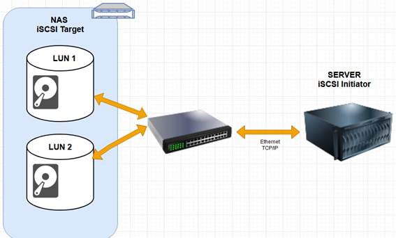
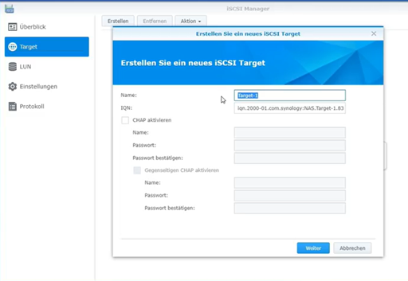
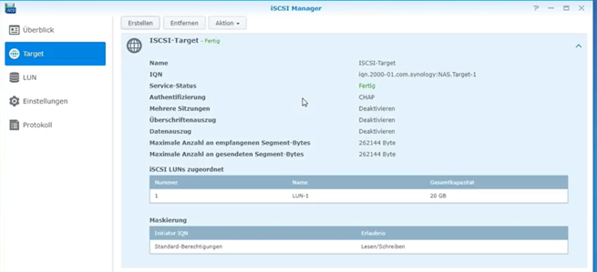
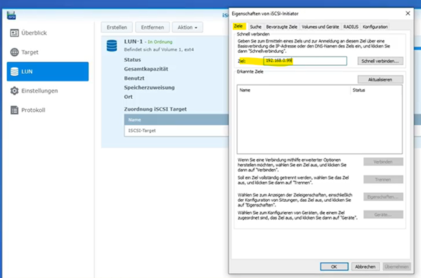
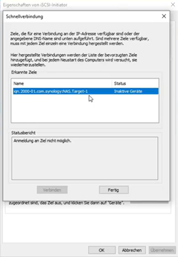
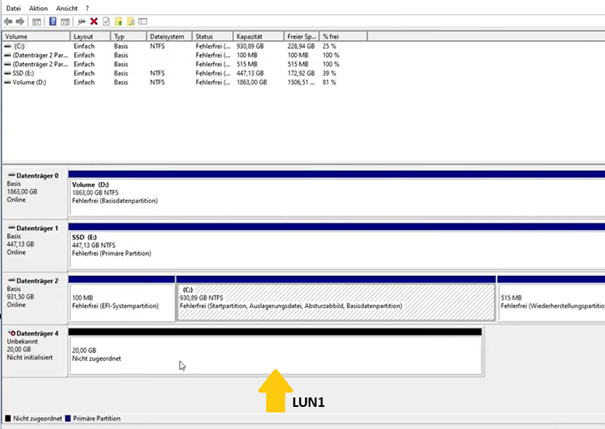

###iSCSI###

iSCSI ist ein Layer-5-Protokoll und steht für Internet Small Computer System Interface. Es handelt sich um ein Netzwerkprotokoll, das die Verbindung von Speichergeräten über TCP/IP-Netzwerke ermöglicht. Es überträgt SCSI-Befehle über IP-basierte Netzwerke und ermöglicht somit die Nutzung entfernter Speicherressourcen, als wären sie lokal an ein System angeschlossen.
iSCSI erleichtert den Aufbau von Storage Area Networks (SANs) und wird häufig in Rechenzentren und Unternehmensumgebungen verwendet, um flexible, zentrale und skalierbare Speicherlösungen bereitzustellen.

iSCSI kommt in vielen typischen Unternehmensszenarien zum Einsatz:
*	Aufbau und Betrieb von Storage Area Networks (SANs)
*	Virtualisierte Umgebungen, z. B. Bereitstellung von gemeinsamem Speicher für virtuelle Maschinen
*	Backups und Disaster Recovery
*	Zentrale Speicherverwaltung und Storage-Konsolidierung

iSCSI kann über sämtliche IP-basierten Netzwerke betrieben werden: LAN (Local Area Network), WAN (Wide Area Network) und Internet (z. B. für Offsite-Backup).
Für eine optimale Leistung mit iSCSI sollten folgende Punkte beachtet werden:
* Ausreichende Bandbreite (z. B. 10 GbE)
* Minimierung von Latenzen
* Quality of Service (QoS) zur Priorisierung von Storage-Traffic
* Netzwerktrennung, z. B. über VLANs oder dedizierte Interfaces, um Engpässe zu vermeiden

iSCSI kapselt SCSI-Befehle in TCP/IP-Pakete ein, sodass diese über herkömmliche Netzwerke transportiert werden können. Dabei übernimmt ein Initiator (meist ein Server) die Rolle des Clients und sendet die SCSI-Kommandos an ein Target (ein Speichergerät), das die Befehle verarbeitet und die Daten zurückliefert.
Die zentralen Komponenten einer iSCSI-Verbindung sind der Initiator, der als Client fungiert und Speicher anfordert, sowie das Target, das als Server Speicherressourcen bereitstellt.

iSCSI-Initiator: Der Client in einem iSCSI-Netzwerk, der Speicher anfragt. Es gibt:
* Hardware-Initiatoren (iSCSI HBAs): Spezialisierte PCIe-Karten mit eigenständiger iSCSI-Unterstützung, z. B. zum Booten via iSCSI.
* Software-Initiatoren: Laufen als Treiber oder Dienste im Betriebssystem, z. B. Microsoft iSCSI Initiator, Linux open-iscsi, VMware ESX/ESXi. Sie nutzen die normale Netzwerkkarte und die CPU des Systems.

Ein iSCSI Qualified Name (IQN) ist ein weltweit eindeutiger Bezeichner, der zur Identifizierung eines iSCSI-Ziels durch den Initiator verwendet wird. Der IQN wird beim Verbindungsaufbau angegeben und dient der eindeutigen Zuweisung.
iSCSI-Target: Ein Server oder Gerät, das Speicher zur Verfügung stellt. Dieser stellt eine oder mehrere Logical Units (LUNs) oder auch Blockdevice bereit, auf die Initiatoren zugreifen können. 
Beispiele für Targets:
* Disk-Arrays
* Speicherserver
* Bandbibliotheken

Ein wichtiges Sicherheitsmerkmal ist die Authentifizierung über CHAP (Challenge-Handshake Authentication Protocol). Beim CHAP-Verfahren sendet der Initiator eine Challenge an das Ziel, das daraufhin mit einem Wert antwortet, der aus einem gemeinsam bekannten Geheimnis berechnet wurde. Stimmt dieser Wert mit den Erwartungen überein, wird die Verbindung autorisiert. Dies verhindert unbefugten Zugriff auf Speicherressourcen.
Zusätzliche Sicherheitsmaßnahmen:
* IPsec-Verschlüsselung zum Schutz der übertragenen Daten
* Netzwerkisolierung, z. B. durch:
* dedizierte VLANs
* separate physische Netzwerke für Storage-Traffic

Die Vorteile von iSCSI:
* Kosteneffizient: nutzung vorhandener IP-Netzwerkinfrastruktur ohne spezielle Hardware
* Einfache Implementierung im Vergleich zu Fibre Channel
* Hohe Skalierbarkeit: Speicher kann flexibel erweitert werden
* Breite Kompatibilität: läuft auf gängiger Hardware und Betriebssystemen
* Virtualisierungsfreundlich: unterstützt Funktionen wie Live-Migration, Hochverfügbarkeit und Clustering

Fibre Channel hat einige klare Nachteile, besonders im Vergleich zu iSCSI:
* Hohe Kosten für Hardware und Infrastruktur (Fibre Channel-fähige Speichergeräte, FC Switche)
* Reichweite begrenzt
* Flexibilität 

Target wird auf einer NAS 192.168.0.99 erstellt. Dabei erhält man IQN und LUN wird zugeordnet.

