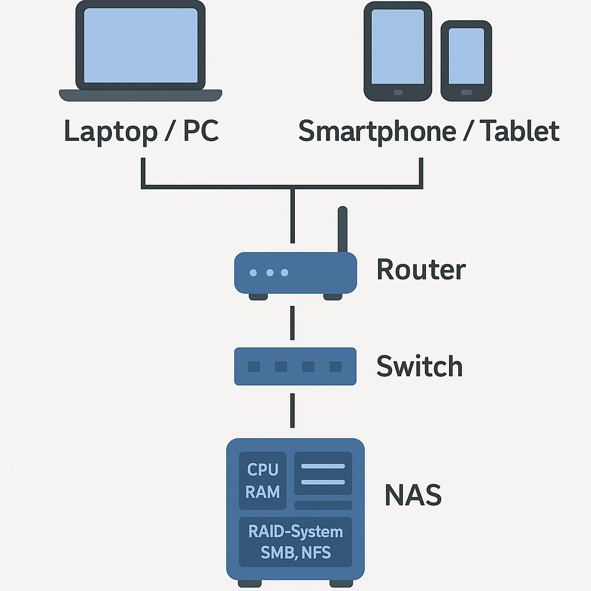

# Network Attached Storage (NAS)

## Einführung

Ein Network Attached Storage (NAS) ist ein netzwerkgebundener Speicher, der zentral Daten bereitstellt, auf die mehrere Benutzer gleichzeitig zugreifen können. Im Unterschied zu direkt angeschlossenen Festplatten (Direct Attached Storage – DAS) funktioniert ein NAS über das lokale Netzwerk (LAN) oder, bei Bedarf, auch über das Internet. NAS-Geräte sind in privaten Haushalten ebenso verbreitet wie in kleinen und mittelständischen Unternehmen. Sie ermöglichen unter anderem die gemeinsame Nutzung von Dateien, automatische Backups, Medienstreaming und den ortsunabhängigen Zugriff auf Daten.

## Einsatzbereiche

NAS-Systeme sind vielseitig einsetzbar. Im privaten Bereich werden sie häufig für die zentrale Ablage von Dokumenten, Fotos und Videos genutzt. Sie dienen als Medienserver (z. B. mit Plex oder DLNA) oder zur automatischen Sicherung von Geräten wie Smartphones oder Laptops. In Unternehmen kommen NAS-Systeme zur gemeinsamen Dateinutzung, für projektbasierte Dateiablagen, als Backup-Ziel oder als Plattform für Anwendungen wie Nextcloud oder Git-Repositories zum Einsatz. Auch in Szenarien wie Videoüberwachung oder Virtualisierung können NAS-Geräte eingebunden werden – z. B. als iSCSI-Ziel für virtuelle Maschinen.

## Technischer Aufbau

Ein typisches NAS besteht aus einem kompakten Gehäuse mit mehreren Festplatteneinschüben (2 bis über 16), einem Prozessor (ARM oder x86), Arbeitsspeicher (typisch 2–16 GB RAM) und mindestens einem Netzwerkanschluss (1 Gbit/s oder schneller). Die Festplatten können als einzelne Laufwerke oder in einem RAID-Verbund betrieben werden, um Ausfallsicherheit und Performance zu verbessern.

Als Betriebssystem kommt meist eine angepasste Linux-Distribution zum Einsatz. Bekannte Systeme sind etwa DSM von Synology, QTS von QNAP oder das quelloffene TrueNAS. Die Verwaltung erfolgt in der Regel über eine webbasierte Benutzeroberfläche, auf der Freigaben, Benutzerkonten, Zugriffsrechte und Zusatzdienste konfiguriert werden können. Erweiterungen wie Docker, Virtualisierung oder Cloud-Synchronisierung sind bei vielen Geräten verfügbar.

## RAID – Redundanz durch Festplattenverbund

RAID (Redundant Array of Independent Disks) ist eine Methode, um mehrere Festplatten zu einem logischen Laufwerk zusammenzufassen. Dabei werden je nach RAID-Level Daten gespiegelt, verteilt oder mit Paritätsinformationen ergänzt. Gängige RAID-Level im NAS-Umfeld sind:

- **RAID 1:** Spiegelung – hohe Datensicherheit, aber nur 50 % der Gesamtkapazität nutzbar.
- **RAID 5:** Verteilung mit einfacher Parität – gute Kombination aus Kapazität, Performance und Redundanz (mind. 3 Laufwerke).
- **RAID 6:** Wie RAID 5, aber mit doppelter Parität – sicher bei Ausfall von zwei Laufwerken.
- **RAID 10:** Kombination aus Striping und Spiegelung – sehr hohe Performance und Sicherheit, benötigt mind. 4 Laufwerke.

Wichtig: RAID schützt vor Festplattenausfällen, ersetzt aber kein Backup.

## Protokolle für Dateizugriff und Übertragung

NAS-Systeme unterstützen eine Vielzahl an Protokollen, um den Zugriff von verschiedenen Betriebssystemen und Geräten zu ermöglichen:

- **SMB (Server Message Block):** Standardprotokoll für Windows-Netzwerke, auch von macOS und Linux unterstützt.
- **NFS (Network File System):** Optimiert für Linux- und Unix-Systeme.
- **AFP:** Ehemaliges Apple-Protokoll, mittlerweile durch SMB ersetzt.
- **FTP/SFTP:** Für klassische Dateiübertragung, insbesondere bei Remote-Zugriffen.
- **WebDAV:** Ermöglicht Zugriff über Webbrowser oder Cloud-Anwendungen.
- **iSCSI:** Blockbasierter Zugriff, z. B. für virtuelle Maschinen oder Serveranwendungen.

## Sicherheit bei NAS-Systemen

Sicherheit ist ein zentrales Thema bei NAS, da häufig sensible oder personenbezogene Daten gespeichert werden. Ein NAS, das im Dauerbetrieb im Netzwerk hängt, kann bei falscher Konfiguration ein Einfallstor sein – besonders, wenn es über das Internet erreichbar ist.

### Physische Sicherheit

Das Gerät sollte an einem geschützten Ort stehen – idealerweise in einem abschließbaren Raum oder Serverschrank. Eine unterbrechungsfreie Stromversorgung (USV) schützt bei Stromausfällen vor Datenverlust. Für Geschäftsräume kann auch ein Diebstahlschutz sinnvoll sein.

### Physische Sicherheit
- Aufstellung in einem geschützten, abschließbaren Raum
- Einsatz einer unterbrechungsfreien Stromversorgung (USV) gegen Stromausfall
- Optional: Diebstahlschutz oder Serverrack-Befestigung

### Zugriff und Benutzerrechte
- Verwendung von Einzelkonten mit klar definierten Zugriffsrechten
- Komplexe Passwörter und regelmäßiger Passwortwechsel
- Protokollierung von Zugriffen und Änderungen zur Nachvollziehbarkeit

### Netzwerkschutz
- Zugriff aus dem Internet nur über sichere Verbindungen (z. B. VPN)
- Aktivierung von Zwei-Faktor-Authentifizierung (2FA)
- Nutzung verschlüsselter Übertragungen: HTTPS, SFTP, SMB über TLS
- Deaktivierung nicht benötigter Dienste wie FTP oder Telnet

### Systempflege
- Regelmäßige Updates des Betriebssystems und installierter Pakete
- Keine Installation unsicherer Drittanbieter-Software
- Absicherung über integrierte Firewalls und IP-Zugriffsfilter

### Datensicherheit
- Möglichkeit zur Verschlüsselung von Volumes oder Freigaben
- Nutzung von Snapshots und Dateiversionierung zum Schutz vor Ransomware
- Umsetzung eines Backup-Konzepts nach der 3-2-1-Regel:
  - 3 Kopien der Daten
  - auf 2 verschiedenen Speichermedien
  - 1 Kopie außerhalb des NAS (z. B. auf externem Laufwerk oder zweitem NAS)

## Visualisierung der Architektur

## Fazit

Ein NAS ist eine leistungsfähige und vielseitige Speicherlösung, die sowohl im privaten als auch im beruflichen Umfeld viele Vorteile bietet. Mit Unterstützung für verschiedene Protokolle, Benutzerverwaltung, RAID-Schutz und Zusatzfunktionen wie Medienserver oder Cloud-Synchronisation ist ein NAS weit mehr als nur ein Datenspeicher. Gleichzeitig verlangt der Betrieb eines NAS ein gewisses Maß an technischer Verantwortung – insbesondere im Bereich Sicherheit, Backup und Systempflege. Wer sich jedoch mit den Grundlagen vertraut macht, erhält ein stabiles und langfristig nutzbares System zur zentralen Datenhaltung.
