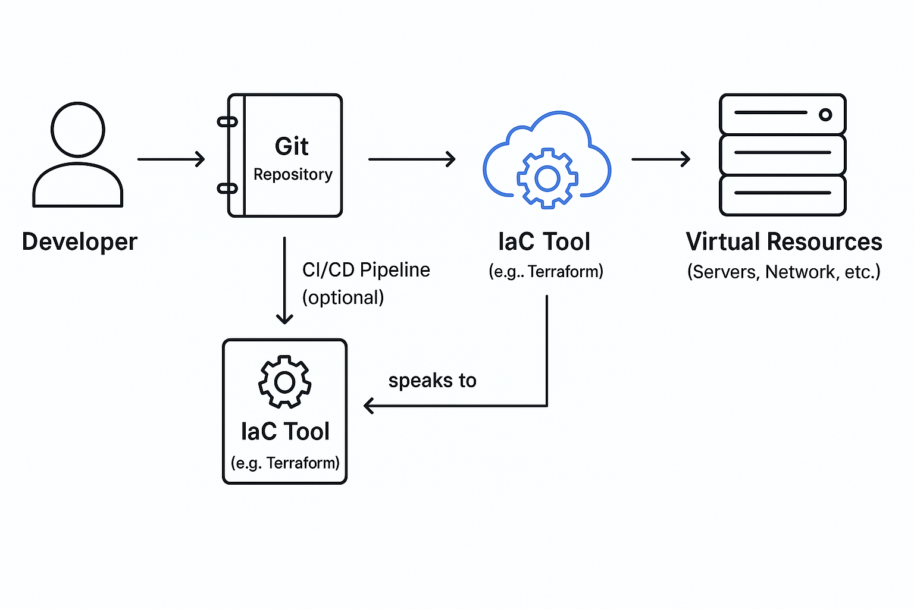

# Infrastructure as Code (IaC)

## Was ist Infrastructure as Code?

Infrastructure as Code (IaC) ist ein Konzept, bei dem IT-Infrastruktur nicht mehr manuell eingerichtet, sondern in Form von Code beschrieben und automatisiert bereitgestellt wird. Dazu gehören z.B. virtuelle Server, Netzwerke, Datenbanken, Firewalls oder Storage-Systeme, also die gesamte Infrastruktur, die eine Anwendung zum Laufen benötigt.

Statt sich per Mausklick durch eine Weboberfläche (z.B. bei AWS oder Azure) zu klicken, wird der gewünschte Zustand in Textdateien beschrieben. Diese Dateien werden von speziellen Tools verarbeitet und setzen die Infrastruktur automatisch um. 

## Warum wird Infrastructure as Code verwendet?

Die Verwaltung von IT-Infrastruktur ist in den letzten Jahren deutlich anspruchsvoller geworden, insbesondere durch den verstärkten Einsatz dynamischer Cloud-Umgebungen. Manuelle Konfigurationen stoßen dabei schnell an ihre Grenzen: Sie sind fehleranfällig, zeitaufwendig und nur schwer nachvollziehbar oder reproduzierbar.

Infrastructure as Code (IaC) wurde entwickelt, um genau diese Probleme zu lösen. Es ermöglicht, Infrastruktur in Form von Code zu beschreiben, automatisiert bereitzustellen und zentral zu verwalten. Dadurch wird Infrastruktur ähnlich behandelt wie Software: versionierbar, wiederholbar und skalierbar.

### Vorteile

- **Automatisierung**: Infrastruktur wie Server und Netzwerke lassen sich automatisiert erstellen, ändern und löschen.
- **Reproduzierbarkeit und Konsistenz**: Gleiche Definitionen erzeugen identische Systeme – das verhindert Abweichungen zwischen Entwicklungs-, Test- und Produktionsumgebungen.
- **Versionierbarkeit**: Änderungen werden wie Code versioniert und sind über Git oder andere Systeme jederzeit nachvollziehbar, vergleichbar oder zurücksetzbar.
- **Transparenz und Dokumentation**: Der Infrastrukturcode dient gleichzeitig als technische Dokumentation
- **Skalierbarkeit**: Neue Instanzen oder komplette Umgebungen lassen sich schnell und zuverlässig bereitstellen
- **Testbarkeit**: Tools ermöglichen die Vorabprüfung von Infrastrukturänderungen vor dem Rollout (z.B. `terraform validate`).
- **Schnelle Bereitstellung**: Infrastruktur kann automatisiert, konsistent und in kurzer Zeit ohne manuelle Schritte aufgesetzt werden
- **Weniger Fehler**: Standardisierte Definitionen und automatisierte Ausführung reduzieren typische Konfigurationsfehler

### Nachteile

- **Einlernaufwand für neue Tools**: Die Einarbeitung in Tools wie Terraform oder Ansible erfordert technisches Verständnis und initialen Aufwand
- **Abhängigkeit von Tools**: Unterschiedliche Tools haben eigene Syntax, Eigenheiten und Lernkurven. Ein Wechsel ist oft aufwendig
- **Fehlkonfigurationen können schwerwiegende Folgen haben**: Fehler im Code wirken sich direkt auf produktive Systeme aus (inklusive versehentlicher Löschungen)
- **Sensibler Umgang mit Zugangsdaten erforderlich**: API-Keys und Zugangsdaten dürfen nicht im Code landen, sondern müssen über externe Tools verwaltet werden

## Funktionsweise und zentrale Konzepte

Der Kern von IaC ist eine deklarative oder imperative Beschreibung der Infrastruktur:

- **Deklarativ**: Es wird definiert, wie der Endzustand aussehen soll (z.B. „es soll ein Webserver existieren“). Das Tool kümmert sich um die Umsetzung.
- **Imperativ**: Schritt-für-Schritt-Anweisungen zur Erreichung des Zielzustands werden vorgegeben (ähnlich wie in klassischen Programmen).

Die Infrastrukturdefinition wird in einer Datei geschrieben (z.B. `.tf`, `.yaml`, `.json`) und an ein Tool wie Terraform oder Ansible übergeben. Dieses Tool analysiert den aktuellen Zustand und vergleicht ihn mit dem Soll-Zustand. Anschließend erzeugt oder verändert es gezielt die nötigen Ressourcen.

## Tools und Technologien

Für die Umsetzung von IaC existieren verschiedene Werkzeuge, die sich in Funktion und Einsatzgebiet unterscheiden:

- **Terraform** (HashiCorp): Open-Source, Multi-Cloud-fähig, deklarativer Ansatz
- **Kubernetes + YAML**: Infrastruktur und Deployments in Kubernetes werden ebenfalls als Code verwaltet (meist in YAML-Dateien)
- **AWS CloudFormation**: Speziell für Amazon Web Services, YAML-/JSON-basiert
- **Pulumi**: Nutzt echte Programmiersprachen (z.B. TypeScript, Python), eher entwicklerzentriert
- **Ansible**: YAML-basiert, mischt Infrastruktur-Provisionierung mit Konfigurationsmanagement
- **Chef, Puppet, SaltStack**: Ursprünglich für Konfiguration von Systemen gedacht, heute auch mit IaC-Funktionalität

Je nach Anwendungsfall und vorhandener Umgebung kann das passende Tool ausgewählt werden.

## Architektur / Beispielvisualisierung

## Fazit

Infrastructure as Code ist ein essenzielles Konzept in der modernen IT. Es erlaubt die automatisierte, zuverlässige und nachvollziehbare Verwaltung von IT-Ressourcen. Durch die Nutzung von Code wird Infrastruktur versionierbar, portierbar und dokumentiert.

IaC reduziert nicht nur manuelle Aufwände, sondern schafft eine technische Grundlage für Skalierung, Teamarbeit und moderne Deployment-Prozesse. Wer heute Cloud-basierte Systeme entwickelt oder betreibt, kommt an IaC nicht mehr vorbei.
