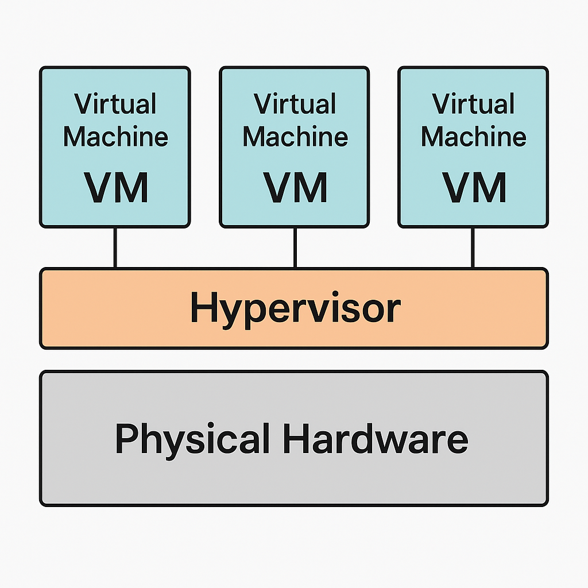

# Problems and Limitations of Virtualization

## 1. Einführung: Was ist Virtualisierung?

Virtualisierung bezeichnet in der Informatik die Nachbildung von Hard- oder Softwarekomponenten durch eine Abstraktionsschicht. Dadurch können mehrere virtuelle Maschinen (VMs) auf einer physischen Hardware betrieben werden, was zu einer effizienteren Ressourcennutzung führt. Ein zentrales Element der Virtualisierung ist der Hypervisor, der als Vermittler zwischen der physischen Hardware und den VMs fungiert.  
 
---

## 2. Kontext und Einsatzbereiche

Virtualisierung findet Anwendung in verschiedenen Bereichen der IT, insbesondere in Rechenzentren, Cloud-Computing-Umgebungen und bei der Serverkonsolidierung. Sie ermöglicht eine flexible und skalierbare IT-Infrastruktur, die auf sich ändernde Anforderungen reagieren kann.

Typische Einsatzbereiche:

- Cloud Computing (z. B. AWS, Azure)
- Testing und Softwareentwicklung
- Hochverfügbarkeit und Lastverteilung

---

## 3. Technische Funktionsweise

Die Virtualisierung basiert auf dem Einsatz von Hypervisoren, die in zwei Hauptkategorien unterteilt werden:

### Typ-1-Hypervisor

Diese laufen direkt auf der Hardware ohne ein darunterliegendes Betriebssystem.  
**Beispiele:** VMware ESXi, Microsoft Hyper-V  

**Vorteile:**
- Höhere Performance
- Bessere Isolation und Sicherheit
- Direkter Zugriff auf Hardware

### Typ-2-Hypervisor

Diese werden auf einem bestehenden Betriebssystem installiert.  
**Beispiele:** Oracle VirtualBox, VMware Workstation  

**Vorteile:**
- Einfach zu installieren und zu nutzen
- Ideal für Einzelgeräte oder lokale Tests

Der Hypervisor verwaltet die Ressourcenverteilung und sorgt dafür, dass die VMs isoliert voneinander betrieben werden können.

---

## 4. Gängige Protokolle, Produkte und Tools

Zu den verbreiteten Virtualisierungsplattformen gehören:

- **VMware vSphere**: Eine umfassende Suite für die Servervirtualisierung.  
- **Microsoft Hyper-V**: In Windows Server integrierte Virtualisierungslösung.  
- **KVM (Kernel-based Virtual Machine)**: Eine Open-Source-Virtualisierungslösung für Linux.  

---

## 5. Probleme und Einschränkungen der Virtualisierung

### 5.1 Performance-Einbußen

Die zusätzliche Abstraktionsschicht durch den Hypervisor kann zu Leistungseinbußen führen, insbesondere bei ressourcenintensiven Anwendungen oder Echtzeitsystemen.

### 5.2 Komplexität und Verwaltungsaufwand

Die Verwaltung virtueller Umgebungen erfordert spezialisiertes Wissen. Fehler in der Konfiguration können zu Sicherheitslücken oder Systemausfällen führen.

### 5.3 Sicherheitsrisiken

Eine erhöhte Angriffsfläche entsteht, da mehrere VMs auf einer physischen Hardware laufen. Ein erfolgreicher Angriff auf den Hypervisor kann alle VMs kompromittieren.

### 5.4 Lizenzierungsprobleme

Die Lizenzierung von Software in virtualisierten Umgebungen kann komplex sein. Einige Lizenzen sind an physische Hardware gebunden, was in virtuellen Umgebungen zu Compliance-Problemen führen kann.

### 5.5 Hardwareabhängigkeiten

Bestimmte spezialisierte Hardwarekomponenten, wie GPUs oder spezifische Schnittstellen, lassen sich schwer oder gar nicht virtualisieren, was die Einsatzmöglichkeiten einschränkt.

### 5.6 Single Point of Failure

Ein Ausfall des physischen Hosts kann alle darauf laufenden VMs betreffen, was zu erheblichen Ausfallzeiten führt.

### 5.7 Lizenzkosten

Siehe VMware (Broadcom)

### 5.8 Vergleich mit nicht-virtualisierten Umgebungen

Im Vergleich zu klassischen (nicht-virtualisierten) Systemen ergeben sich bei der Virtualisierung zusätzliche Herausforderungen:

- **Maximale Performance ohne Overhead**  
  Anwendungen laufen direkt auf der Hardware ohne Zwischenschicht wie Hypervisor oder Host-OS. Das reduziert Latenzen und erhöht die Effizienz – besonders bei rechenintensiven oder zeitkritischen Workloads.

- **Einfacheres Systemdesign & Fehlersuche**  
  Da keine zusätzliche Virtualisierungsschicht vorhanden ist, ist das System übersichtlicher und Probleme lassen sich leichter identifizieren und beheben.

- **Direkter und vollständiger Hardwarezugriff**  
  Spezialisierte Hardwarekomponenten wie GPUs, PCIe-Karten oder Industrie-I/O-Interfaces können ohne Einschränkungen genutzt werden.

- **Stabilität und Vorhersehbarkeit**  
  Ressourcen wie CPU, RAM oder Speicherbandbreite werden nicht mit anderen VMs geteilt
---

## 6. Fazit

Virtualisierung bietet viele Vorteile, wie eine effizientere Ressourcennutzung, erhöhte Flexibilität und bessere Skalierbarkeit. Jedoch müssen die genannten Probleme und Einschränkungen bei der Planung und Implementierung berücksichtigt werden, um eine stabile und sichere IT-Infrastruktur zu gewährleisten.

---

## 7. Architekturabbildung

